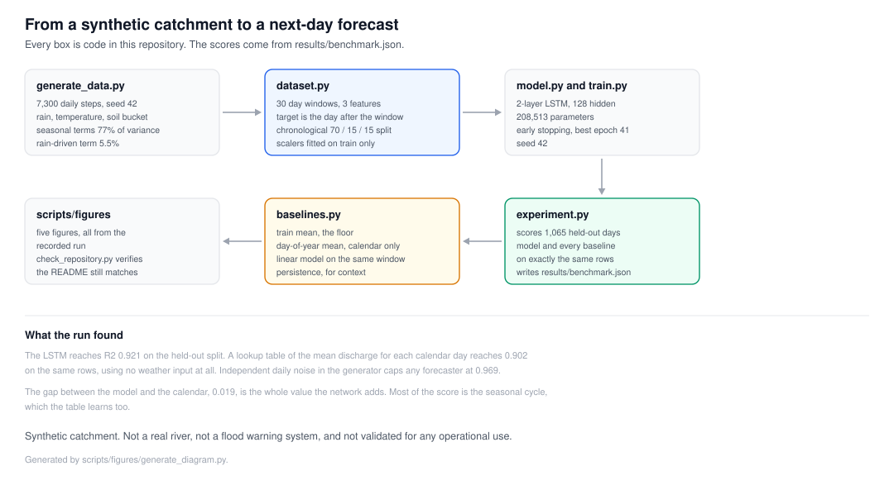
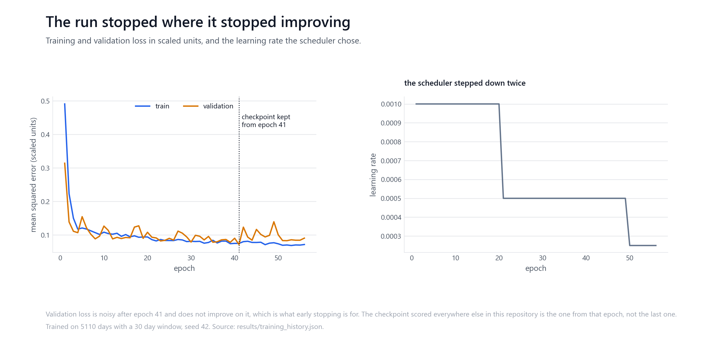
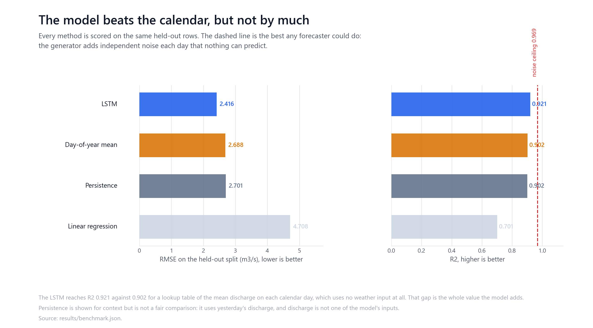
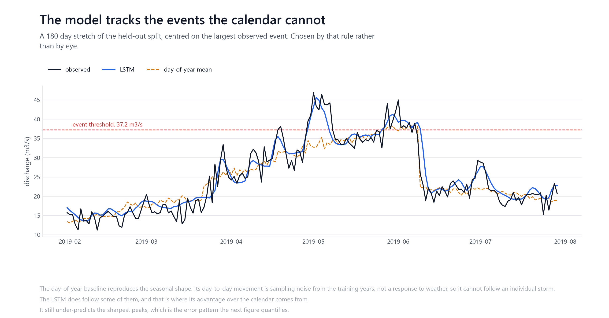
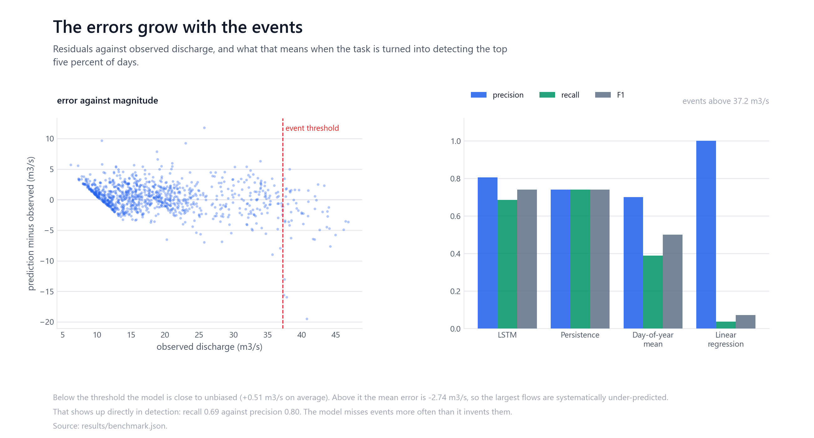

# LSTM discharge forecasting on a synthetic catchment

A controlled time-series experiment. An LSTM reads 30 days of precipitation,
temperature and soil moisture, and predicts the next day's river discharge on a
synthetic catchment generated by a deterministic rainfall-runoff model.

**The catchment is not real.** There is no observed data here, no gauge, no site.
Every number below describes how well the model recovers a signal this repository
generated, and says nothing about skill on a real river. It is not flood
forecasting, not a warning system, and not validated environmental modelling.



## What the experiment is for

The question is narrow and answerable: on a signal whose composition is known
exactly, does an LSTM reading a weather window beat the simple things you would
try first?

That question needs baselines, and a synthetic catchment is the honest way to get
a clean answer, because the generator's own components can be measured. The
seasonal terms, the rainfall response and the irreducible noise are all known, so
it is possible to say not only how well the model does but how well anything
could.

## The generator


Twenty years of daily values from seed 42. Precipitation is intermittent with a
seasonal intensity and occasional extremes. Temperature is seasonal with noise.
Soil moisture is a single bucket driven by infiltration, evapotranspiration and
drainage. Discharge is the sum of four terms: a seasonal baseflow, spring
snowmelt, a quickflow that responds to the last nine days of rain through a fixed
unit hydrograph, and independent measurement noise.

This matters more than any score in this repository. The two seasonal terms
account for **77%** of the target's variance and the rain-driven term for **5.5%**.
A forecaster can therefore do well here by learning the calendar, and doing well
is not evidence of rainfall-runoff skill.

**A defect was found and fixed.** The bucket was mis-scaled: mean
evapotranspiration ran at roughly four times mean infiltration, so storage
collapsed onto its lower clip bound and stayed there on **82% of days**. Soil
moisture was effectively a constant, and the nonlinear runoff response it was
supposed to drive varied by under 5%. With the coefficients rebalanced it sits at
the floor on 13% of days and spans most of its range, and the rain-driven share of
the target rose from 1.7% to 5.5%. All results below are from after that fix.

## The task

One step ahead regression. Sample `i` reads rows `i` to `i+29` of the three
features and predicts discharge at row `i+30`. The target day is never inside its
own input window, and discharge is not among the inputs, so the model never sees
past discharge.

Splits are chronological at 70/15/15 and the scalers are fitted on the training
rows only. Each split builds its windows from its own slice, so no window spans a
boundary.

## The model

Two-layer LSTM, 128 hidden units, dropout 0.2, a dense head, 208,513 parameters.
Adam at 1e-3 with weight decay, gradient clipping, `ReduceLROnPlateau`, early
stopping on validation loss, seed 42.



## Baselines

A score means little alone, so three baselines are computed on exactly the same
held-out rows:

| Baseline | What it uses |
| --- | --- |
| Train mean | Nothing. The floor. |
| Day-of-year mean | The calendar only, no weather input |
| Linear regression | The same 30-day window the LSTM reads |

Persistence, yesterday's discharge, is reported alongside them but is not a fair
comparison: discharge is not one of the model's inputs.

## Results



Held out: the final 15% of the record, 1065 days, scored once.

| Method | RMSE (m3/s) | MAE (m3/s) | R2 |
| --- | --- | --- | --- |
| **LSTM** | **2.416** | **1.741** | **0.921** |
| Day-of-year mean | 2.688 | 1.912 | 0.902 |
| Persistence | 2.701 | 2.066 | 0.902 |
| Linear regression | 4.708 | 3.594 | 0.701 |
| Train mean | 8.614 | 6.764 | -0.001 |

The generator adds independent noise every day that nothing can predict, which
caps R2 at **0.969**. The LSTM reaches 0.921 against 0.902 for a lookup table of
the mean discharge on each calendar day. That 0.019 gap, between the calendar and
the model, is the entire value the network adds.

It is worth being blunt about the size of that gap. Most of what the model scores
comes from learning the seasonal cycle, which a table of 365 numbers also learns,
and the linear model on the same window does far worse than either.

## What a forecast looks like



A 180 day stretch centred on the largest observed event, chosen by that rule
rather than by eye. The day-of-year baseline reproduces the seasonal shape but
cannot respond to a storm. The LSTM follows some of them, and that is where its
advantage comes from.

## Error analysis



The errors are not uniform. Below the event threshold the model is close to
unbiased at +0.51 m3/s; above it the mean error is -2.74 m3/s, so the largest
flows are systematically under-predicted. That is ordinary regression to the mean
and it matters here, because the largest flows are the only ones anyone would care
about.

Turning the regression into detecting the top 5% of days at a 37.21 m3/s
threshold:

| Method | Precision | Recall | F1 |
| --- | --- | --- | --- |
| LSTM | 0.804 | 0.685 | 0.740 |
| Persistence | 0.741 | 0.741 | 0.741 |
| Day-of-year mean | 0.700 | 0.389 | 0.500 |
| Linear regression | 1.000 | 0.037 | 0.071 |

Recall below precision is the under-prediction showing through: the model misses
events more often than it invents them. Persistence matches its F1 while using an
input the model does not have.

## Reproducing

```bash
pip install -r requirements.txt

python src/generate_data.py     # seed 42, deterministic
python src/train.py             # about two minutes on a CPU
python src/experiment.py        # scores the model and every baseline
```

`src/experiment.py` writes `results/benchmark.json`, which holds every number
quoted above. Figures regenerate from it:

```bash
pip install -r requirements-dev.txt
python scripts/figures/generate_figures.py
python -m pytest -q
python scripts/check_repository.py
```

That check confirms the artifacts exist and that every number quoted in this
README still matches `results/benchmark.json`, so the text and the recorded run
cannot drift apart quietly. It also checks two things about the run itself.

The figures are held to the run they came from. Each one records a digest of
`results/benchmark.json` and of `results/best_model.pt` in its own file, because
every figure here reloads the checkpoint and recomputes the held-out predictions
rather than only reading numbers out of the benchmark. Comparing the images byte
for byte would not work, and that is measured rather than assumed: `torch` is
deliberately a lower bound in `requirements.txt`, and rendering this set under
2.14.0+cpu instead of the 2.11.0+xpu that produced it reproduces four of the five
files exactly and changes `04_error_analysis.png`, which plots residuals at a
resolution where a last-bit difference in the forward pass moves a point. Every
number in the benchmark is identical between those two builds.

And the run has to be internally consistent, whatever the numbers are. The noise
ceiling must equal one minus the noise share of the target's variance, no method
may score above it, and the two seasonal terms must combine to more than the sum
of their separate shares, which is what makes the 77% worth quoting rather than
the 49.7% those shares add to. None of that depends on the README being right.

It compares the README against the stored result, not against a fresh one.
`src/experiment.py` overwrites `results/benchmark.json` whenever it runs, so
rerunning it would replace the record rather than contradict it. The stronger
check is therefore separate:

```bash
python src/generate_data.py
python src/experiment.py
python scripts/check_reference_run.py
```

That regenerates the data from seed 42, re-scores the committed checkpoint, and
compares the result field by field against the copy committed at `HEAD`,
ignoring only the run timestamp and torch build. CI runs both.

## What is committed, and how it is loaded

`results/best_model.pt` is the trained checkpoint and is committed, so the
published scores can be reproduced without retraining. Both places that load it
pass `weights_only=True`: the file is a plain state dictionary of twelve tensors,
208,513 parameters in total, and restricting the load means a checkpoint cannot
carry anything but weights. That matters because `requirements.txt` accepts
`torch>=2.1`, and the versions before 2.6 unpickle without restriction by default.

The fitted scalers are not committed. `src/train.py` writes them beside the
checkpoint, and nothing in this repository reads them back: every entry point
refits them from the seeded data in well under a second, so the committed copies
were two pickle files with no consumer. They remain reachable in the git history,
as removing a file from the tree does not remove it from the repository, and that
history is not rewritten for an artifact that holds nothing but two means and two
standard deviations.

## Limitations

The catchment is synthetic and simple. Its rainfall-runoff response is a fixed
nine-day unit hydrograph with a soil-moisture-dependent coefficient, which is far
simpler than any real one, and the model is being asked to recover a process this
repository wrote down.

The benchmark is seasonally dominated. A method that learns only the calendar
scores R2 0.902, so headline numbers on this data are not informative about
rainfall-runoff skill without the baseline beside them.

Nothing here transfers to a real catchment. Real records have gauge error,
changing land use, regulation, missing values and non-stationarity, none of which
are present.

The test period is one contiguous stretch of three years, scored once. There is no
repeated-seed study, so the 0.019 gap over the calendar baseline is a single
measurement rather than a confidence interval.

## Provenance

The generator, model, training loop, baselines, experiment runner, tests and
figures are the author's own work. The architecture is a standard stacked LSTM
with a dense head, and torch, scikit-learn, pandas, numpy and matplotlib do the
underlying work.

The framing follows Kratzert et al. (2018), who applied LSTMs to rainfall-runoff
modelling on real catchments. This repository does not reproduce that work and
does not use their data.

## References

- Hochreiter, S. and Schmidhuber, J. (1997). Long Short-Term Memory. Neural Computation.
- Kratzert, F. et al. (2018). Rainfall-Runoff modelling using Long Short-Term Memory networks. Hydrology and Earth System Sciences.
- Nash, J.E. and Sutcliffe, J.V. (1970). River flow forecasting through conceptual models. Journal of Hydrology.

## Licence

MIT. See [LICENSE](LICENSE).
