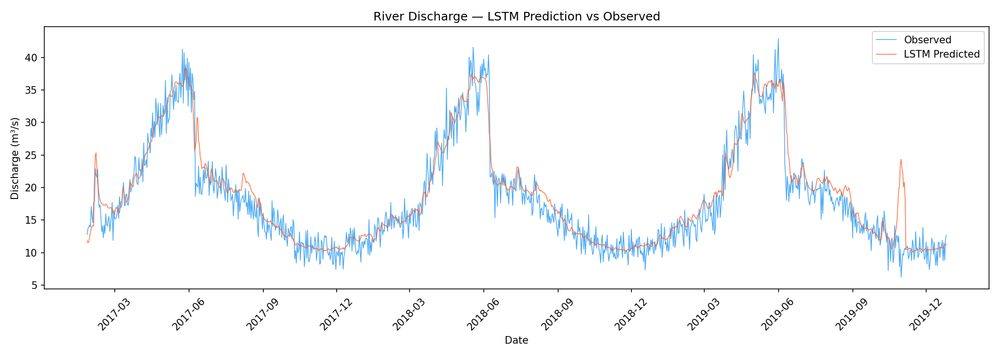
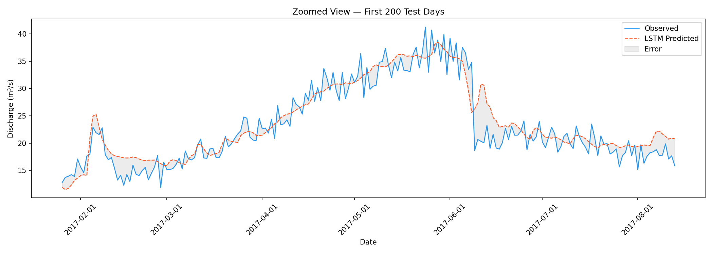
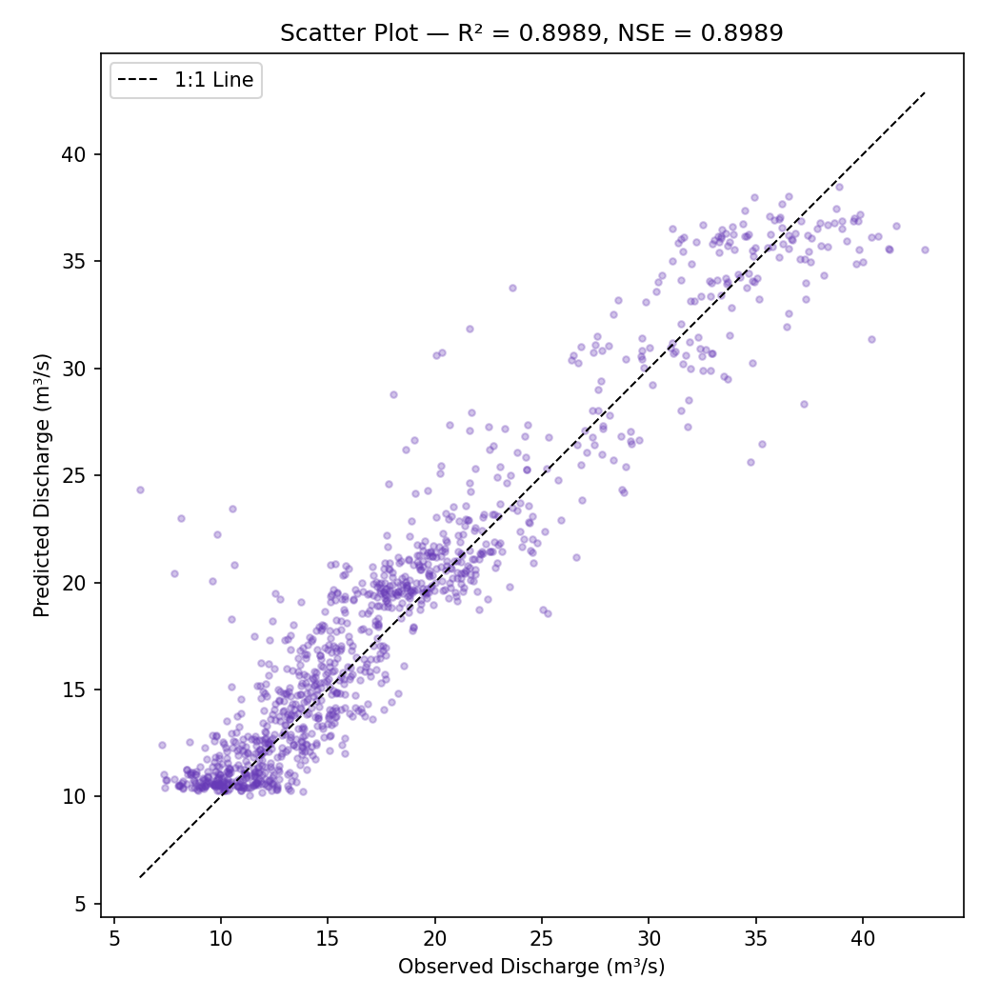
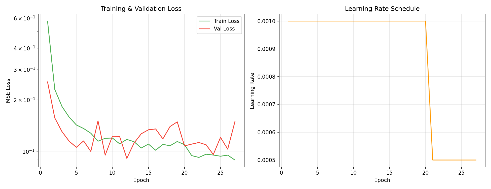
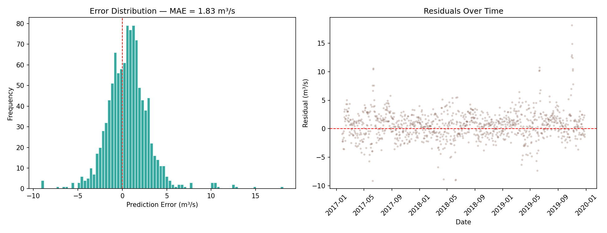
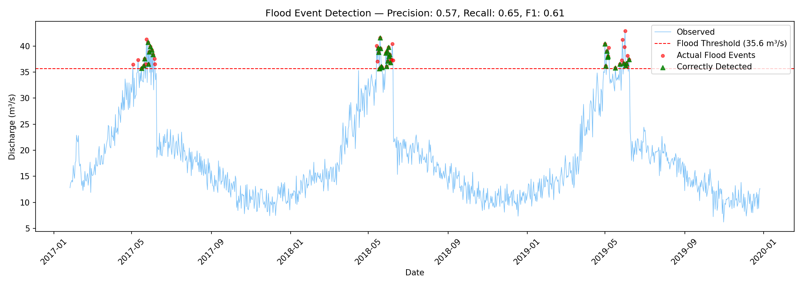

# Deep Learning Flood Prediction with LSTM

LSTM-based deep learning experiment for one-step-ahead river-discharge prediction using PyTorch. The model learns temporal patterns from a deterministic synthetic hydrological time series (precipitation, temperature, and soil moisture).

> **Scope:** This repository is a reproducible synthetic-data demonstration, not a validated flood-forecasting system. The reported metrics and figures describe the generated benchmark only and must not be interpreted as real-catchment performance.

## Results

| Metric | Value |
|--------|-------|
| RMSE | 2.551 m³/s |
| MAE | 1.833 m³/s |
| R² | 0.899 |
| NSE (Nash-Sutcliffe) | 0.899 |
| PBIAS | 3.57% |

### Prediction vs Observed Discharge



### Zoomed View — Test Period



### Scatter Plot (Predicted vs Observed)



### Training Curves



### Error Analysis



### Flood Event Detection (95th Percentile Threshold)



| Metric | Value |
|--------|-------|
| Precision | 0.574 |
| Recall | 0.648 |
| F1 Score | 0.609 |

## Project Structure

```
.
├── src/
│   ├── generate_data.py    # Synthetic hydrological data generation
│   ├── dataset.py          # PyTorch Dataset & DataLoader with normalization
│   ├── model.py            # LSTM architecture definition
│   ├── train.py            # Training loop with early stopping & LR scheduling
│   └── evaluate.py         # Evaluation metrics & visualization
├── data/
│   └── synthetic_hydrology.csv  (generated, not tracked in git)
├── results/
│   ├── best_model.pt            # Trained model weights
│   ├── training_history.json    # Epoch-level loss history
│   ├── hyperparameters.json     # Model configuration
│   ├── test_metrics.json        # Test set evaluation metrics
│   ├── flood_detection_metrics.json
│   ├── scalers/                 # Fitted StandardScalers
│   └── figures/                 # All generated plots
├── requirements.txt
└── README.md
```

## Methodology

1. **Data Generation**: Synthetic daily hydrological time series (20 years) with realistic seasonal patterns, intermittent rainfall, snowmelt dynamics, and nonlinear rainfall-runoff relationships using a conceptual bucket model.

2. **Feature Engineering**: Sliding window approach — 30 days of lagged features (precipitation, temperature, soil moisture) predict the next day's river discharge.

3. **Model Architecture**:
   - 2-layer LSTM encoder (128 hidden units per layer)
   - Fully connected decoder with ReLU activation and dropout
   - Total parameters: ~208K

4. **Training**:
   - 70/15/15 train/validation/test split (chronological)
   - Adam optimizer with weight decay
   - ReduceLROnPlateau scheduler
   - Early stopping (patience=15)
   - Gradient clipping (max_norm=1.0)

5. **Evaluation**: RMSE, MAE, R², Nash-Sutcliffe Efficiency (NSE), Percent Bias (PBIAS), and flood event detection (precision/recall/F1).

## How to Run

```bash
# Install dependencies
pip install -r requirements.txt

# Generate synthetic data
python src/generate_data.py

# Train the model
python src/train.py

# Evaluate and generate plots
python src/evaluate.py
```

The data generator uses seed `42`; rerunning the pipeline recreates the synthetic input. Generated data is intentionally ignored by Git, while the result artifacts shown above are versioned for inspection.

## Reproducibility Check

```bash
python scripts/check_repository.py
```

This lightweight check verifies the tracked source and result artifacts without downloading data or retraining the model.

## Tech Stack

- **PyTorch** — LSTM model, training, GPU acceleration
- **scikit-learn** — Feature scaling, evaluation metrics
- **pandas / NumPy** — Data manipulation
- **matplotlib** — Visualization
- **joblib** — Scaler serialization

## References

- Hochreiter, S. & Schmidhuber, J. (1997). Long Short-Term Memory. *Neural Computation*.
- Kratzert, F. et al. (2018). Rainfall-Runoff modelling using Long Short-Term Memory (LSTM) networks. *Hydrology and Earth System Sciences*.
- Nash, J.E. & Sutcliffe, J.V. (1970). River flow forecasting through conceptual models. *Journal of Hydrology*.

## License

MIT. See [LICENSE](LICENSE).
